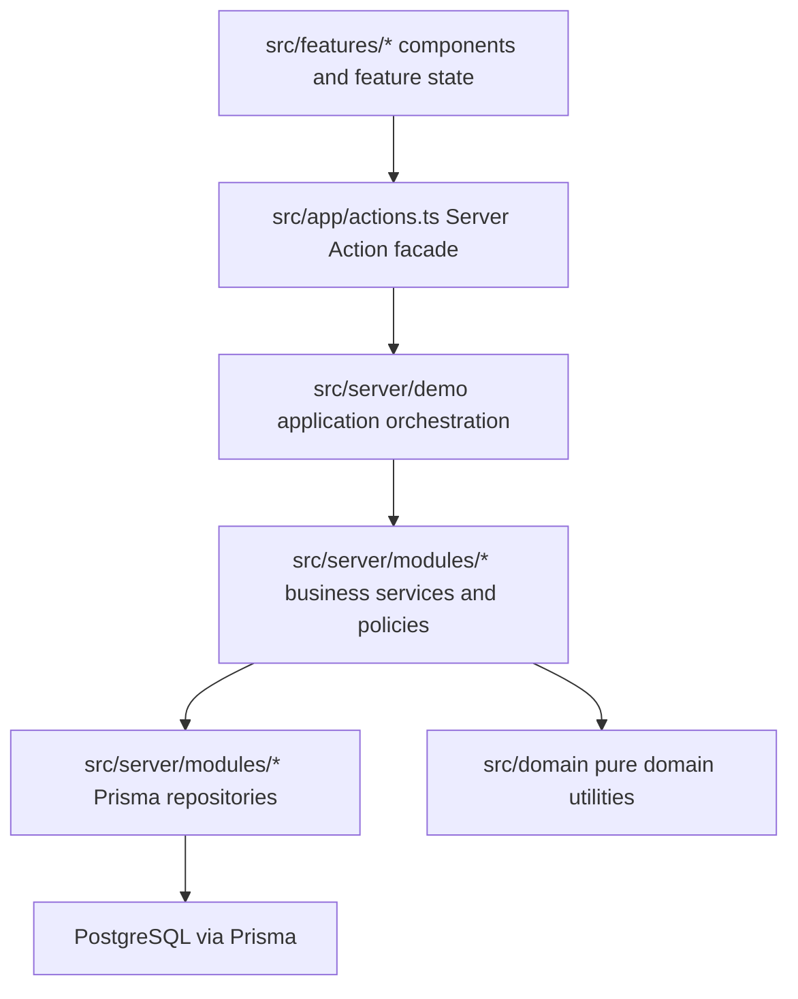

# MerchFlow Architecture And ER Guide

This document explains the current V1 data model and code structure. It is a
companion to the detailed domain and database design documents, with an
emphasis on how the pieces work together in production-like workflows.

## Why The Model Is Structured This Way

MerchFlow serves one small retail organization per user. An organization can
operate multiple stores, while managers and staff can be restricted to
assigned stores.

The model separates:

- Current state from immutable history.
- Commercial records from payment-provider events.
- Organization-wide ownership from store-level authorization.
- Product identity from sellable SKU and barcode identity.

That separation makes common production problems explicit: tenant isolation,
store-scoped access, payment webhook idempotency, stock reconciliation, and
auditability.

## Entity Relationship Diagram

```mermaid
erDiagram
  USER ||--o| ORGANIZATION_MEMBERSHIP : has
  ORGANIZATION ||--o{ ORGANIZATION_MEMBERSHIP : contains
  ORGANIZATION_MEMBERSHIP ||--o{ STORE_ASSIGNMENT : receives
  STORE ||--o{ STORE_ASSIGNMENT : scopes

  ORGANIZATION ||--o{ STORE : owns
  ORGANIZATION ||--o{ PRODUCT : owns
  PRODUCT ||--o{ SKU : contains

  STORE ||--o{ INVENTORY_BALANCE : holds
  SKU ||--o{ INVENTORY_BALANCE : balances
  STORE ||--o{ STOCK_LEDGER : records
  SKU ||--o{ STOCK_LEDGER : moves
  ORGANIZATION_MEMBERSHIP o|--o{ STOCK_LEDGER : acts

  ORGANIZATION ||--o{ CUSTOMER : owns
  CUSTOMER o|--o{ ORDER : places
  STORE ||--o{ ORDER : receives
  ORGANIZATION_MEMBERSHIP ||--o{ ORDER : creates
  ORDER ||--|{ ORDER_ITEM : contains
  SKU ||--o{ ORDER_ITEM : snapshots

  ORDER ||--o| PAYMENT : has
  PAYMENT ||--o{ PAYMENT_EVENT : receives
  ORDER o|--o{ STOCK_LEDGER : explains

  ORGANIZATION ||--o{ AUDIT_LOG : owns
  STORE o|--o{ AUDIT_LOG : scopes
  ORGANIZATION_MEMBERSHIP o|--o{ AUDIT_LOG : acts

  USER {
    string id PK
    string email UK
  }

  ORGANIZATION_MEMBERSHIP {
    string id PK
    string organizationId FK
    string userId FK_UK
    enum role
    enum status
  }

  STORE_ASSIGNMENT {
    string membershipId FK
    string storeId FK
  }

  SKU {
    string id PK
    string organizationId FK
    string barcode
    int priceAmount
  }

  INVENTORY_BALANCE {
    string storeId FK
    string skuId FK
    int quantityOnHand
    int lowStockThreshold
  }

  STOCK_LEDGER {
    string storeId FK
    string skuId FK
    int quantityDelta
    enum reason
    string relatedOrderId FK
  }

  ORDER {
    string id PK
    string storeId FK
    enum status
    int totalAmount
    string currency
  }

  ORDER_ITEM {
    string orderId FK
    string skuId FK
    string skuNameSnapshot
    string barcodeSnapshot
    int unitPriceAmount
    int quantity
  }

  PAYMENT {
    string id PK
    string orderId FK_UK
    string provider
    string providerPaymentId UK
    enum status
  }

  PAYMENT_EVENT {
    string paymentId FK
    string providerEventId UK
    enum processingStatus
  }

  AUDIT_LOG {
    string organizationId FK
    string storeId FK
    string actorMembershipId FK
    string action
    string entityType
    string entityId
  }
```

## Important Data Decisions

### Tenant isolation

Most business tables carry `organizationId`, even when the organization could
be reached through another relation. This makes repository filters explicit
and supports organization-prefixed indexes. Service and authorization layers
must still verify store scope; a tenant column alone is not an authorization
system.

`OrganizationMembership.userId` is unique because the V1 product decision is
that one user belongs to only one organization.

### Inventory balance and ledger

`InventoryBalance` is the fast current-state view used by POS and operations
screens. `StockLedger` is the append-only explanation of how that state
changed.

Updating only the balance would be fast but impossible to reconcile. Writing
only the ledger would be auditable but expensive to total on every scan. A
production implementation updates both in one database transaction.

### Order item snapshots

`OrderItem` stores SKU name, barcode, and unit price snapshots. Catalog data
can change after a sale, but historical receipts, refunds, and reports must
continue to describe what the customer actually purchased.

### Payment event idempotency

Payment providers can retry the same webhook. The unique
`(provider, providerEventId)` constraint prevents the same event from applying
stock and order state transitions twice. A duplicate event is a normal
operational case, not necessarily an error.

### Audit log versus stock ledger

`StockLedger` answers "why did quantity change?" `AuditLog` answers "who
performed a sensitive business action?" They overlap for some operations but
serve different investigation and reporting needs.

## Code Architecture



### Layer responsibilities

| Layer | What it owns | What it must not own |
| --- | --- | --- |
| `src/app` | Next.js routes and public Server Action facade | Business rules or large UI components |
| `src/features` | Feature UI, client state, feature actions/models | Prisma queries or authorization policy |
| `src/server/demo` | Use-case orchestration and serializable action results | Low-level database details |
| `src/server/modules` | Authorization, business rules, repository contracts and implementations | React or route concerns |
| `src/domain` | Pure calculations and value rules | Framework or database dependencies |

## Example Request Flow

Creating and paying for a POS order crosses several boundaries:

1. The POS feature turns scanned cart lines into an order command.
2. `src/app/actions.ts` exposes the Server Action boundary.
3. The demo application layer loads the authenticated organization context.
4. The order service verifies store access, prices items, snapshots catalog
   data, and creates a pending order plus payment.
5. A simulated provider event is processed with an idempotency key.
6. The payment service transitions payment/order state and applies sale stock
   movements only once.
7. Serializable results return to the UI, which updates the operator timeline.

This flow is deliberately layered so each production concern can be tested
without rendering React or connecting to a real payment provider.

## Refactoring Result

The frontend now follows feature-first organization and the backend follows
module-first organization:

```text
src/
  app/                 # Thin Next.js shell
  domain/              # Pure calculations
  features/
    pos/
    control-center/
    operations/
    audit/
    shared/
  server/
    demo/              # Application/use-case orchestration
    modules/           # Business modules and repositories
```

Large feature containers keep workflow state and async orchestration. Focused
components own forms, tables, and display concerns. Tests live beside the
feature or module they protect under `__tests__`.

## Interview Discussion Prompts

- Why is a payment event unique by provider and provider event ID?
- Why are inventory balance and stock ledger both necessary?
- Why does an order item snapshot catalog data?
- Where is tenant isolation enforced, and where is store authorization
  enforced?
- Which operations require a database transaction?
- Why does `src/server/demo` exist between Server Actions and business modules?
- What state remains in POS and Control Center containers after component
  extraction, and why?
